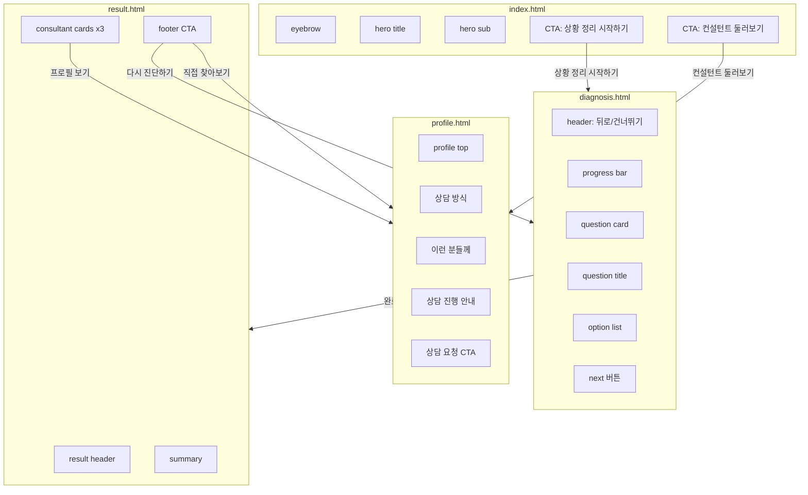

A simple HTML/JS/CSS starter template

```mermaid
flowchart TD
  subgraph I[index.html]
    I1[eyebrow]
    I2[hero title]
    I3[hero sub]
    I4[CTA: 상황 정리 시작하기]
    I5[CTA: 컨설턴트 둘러보기]
  end

  subgraph D[diagnosis.html]
    D1[header: 뒤로/건너뛰기]
    D2[progress bar]
    D3[question card]
    D31[question title]
    D32[option list]
    D33[next 버튼]
  end

  subgraph R[result.html]
    R1[result header]
    R2[summary]
    R3[consultant cards x3]
    R4[footer CTA]
  end

  subgraph P[profile.html]
    P1[profile top]
    P2[상담 방식]
    P3[이런 분들께]
    P4[상담 진행 안내]
    P5[상담 요청 CTA]
  end

  I4 -->|상황 정리 시작하기| D
  I5 -->|컨설턴트 둘러보기| P
  D -->|완료| R
  R3 -->|프로필 보기| P
  R4 -->|다시 진단하기| D
  R4 -->|직접 찾아보기| P
```
